# Tensor Algebra

A Scala language implementation of a tensor algebra designed for GPU/hardware accelerated evaluation. The basic operations of
the algebra are both highly expressive, and highly parallelizable.

Each of the algebra's operations is amenable to highly parallelized implementations.
Therefore it is possible to define different evaluators for efficiently calculating
tensor algebra expressions with parallel processors of
varying scale:
* Hardware computational elements such as GPUs or GPU arrays, multi-core CPUS,
  DSPs, FPGAs, and other specialty computation hardware
* Cloud-based map-reduce systems such as Spark, Google Tensorflow, etc.

The basic operations of the algebra are individually simple to understand. The
algebra is expressive, meaning that even extremely complex N-dimensional computations
can be completely expressed as combinations of these basic operations. For example,
 matrix multiplication, convolution and cross-correlation, Fourier
transforms, etc. can all be expressed with this algebra without looping or recursion.

### Tensor Algebra's Basic Operations

Recall that a "tensor" is just the formal name for an N-dimensional rectangular
array of any dimension. This includes 0-D (scalar values), 1-D (arrays), 2-D (matrixes),
3-D (rectangular volumes), and higher.

An "*algebra*" is a fancy word for a set of combining operations at operate on
the same type of values. In this case, the Tensor Algebra defines a set of basic
operations that all take tensors as input.

The basic operations of this tensor algebra are:
* ***translate*** -- define a new tensor by "moving" values in an original
  tensor to different indexes using fixed offset in one or more dimension
  * Translated tensors are "clipped" to the same dimensionality and magnitude as the original tensor
  * Translated tensors are "backfilled" with a constant value, 0 by default.
* ***broadcast*** -- copying a tensor in one dimension by duplication
    * For example, imagine generating a 3x3x3 volume by duplicating and stacking
      3 copies of a 3x3 tensor. The is a ***broadcast*** in the `_Z` dimension.
    * In theory this can be defined as repeated ***join***s of a tensor with itself.
      However, much more efficient implementations can be achieved by identifying
      ***broadcast*** as a separate operation.
* ***reshape*** -- Without altering the overall number of elements in a tensor,
  define a tensor which takes an original tensor's elements while altering the
  dimensionality and magnitude.
  * For example changing a 3x4x5 tensor into a 10x6 tensor. Same number of elements,
    different dimensionality and magnitude
* ***slice*** -- A tensor defined as a rectangular portion of a source tensor
* ***join*** -- Additively "stack" multiple tensors of the similar dimensionality
  into a single tensor of higher dimensionality and/or magnitude
* ***pivot*** -- Exchange the indexing in 2 dimensions. This effectively "rotates"
  a tensor in 2 of its dimensions. For example, pivoting a 3-D tensor in the
  `_X` and `_Y` dimensions yields a tensor with elements with indexes `(_Y, _X, _Z)`
  order compared to the original tensor.
* ***reverse*** -- Reverse the dimensions of a tensor.
  * For example, after application a 4-D tensor
    would have element indexes effectively reversed to `(_W, _Z, _Y, _X)` order.
  * Could be implemented with repeated ***pivots***. However, much more efficient
    implementations can be achieved by identifying ***reverse*** as a separate
    operation.
* ***map*** -- Create a new tensor by applying a 1:1 mapping from existing element
  values to new element values.
  * Could be defined using ***reduce***. However, much more efficient implementations
    can be achieved by identifying ***map*** as a separate operation.
* ***reduce*** -- Creating a new tensor with reduced dimensionality from an original
  by combining elements along one or more dimensions using an arbitrary associative
  combiner function.
  * Note that the combiner function need not be commutative, only associative. There
    is an implicit ordering to elements defined by the element indexing. Ordering
    is always preserved when applying reducing functions.
* ***aggregate*** -- Creating a new tensor by transforming slices of one
  magnitude into resultant tensors of another dimension, and aggregating the
  results. For example, calculating a histogram of the element values of a tensor
  can easily be defined as an ***aggregate*** operation.

By combining these basic Tensor Algebra operations we can define
very complex operations without undue complexity: matrix multiplication, convolution
& cross-correlation, Fourier transformation, complex image and sound manipulation
functions, particle and field simulations, and much more.

## Tensor Algebra API Examples

### Example 1: Additive Combination of 2 1-D Tensors

The Tensor Algebra API is essentially a set of `TensorExpr` combinator functions.
Each of the basic operators ***translate***, ***reshape***, etc. produce a new
`TensorExpr` from input `TensorExpr` values.

Let's first consider how to define an expression that adds two 1-D tensors of the
same magnitude together. This is the "Hello, World!" of GPU computing. We want to
express element-by-element addition using the Tensor Algebra.

```
def add1DTensors(t1: TensorExpr[Tensor], t2: TensorExpr[Tensor]):
    TensorExpr[Tensor] = {
  // 1. Join the 2 1-D tensors -- "stack" them in the "_Y" dimension
  // --
  val stacked = join(_Y, t1, t2)

  // 2. Reduce the "stacked" tensor by summation in the _Y dimension
  reduce(stacked, _Y, _SUM)
}
```

* Given two tensor expressions of some length L
  * In this example we assume the tensor length match -- ideally
    we would assert this assumption
* First, join the two 1-D tensors. This creates a single tensor `stacked`
  of magnitude Lx2.
* Second, reduce `stacked` in the `_Y` dimension using the `_SUM`
  reduction operation.
* The result will be a tensor expression yielding a 1-D tensor of
  magnitude L where each element is the sum of the corresponding elements in the
  original tensors.

### Example 2: 2-D Cross-Correlation Defined using Tensor Algebra

Let's consider the cross-correlation of an 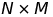 2-D matrix
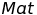 with a 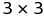 2-D matrix 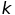
(aka *kernel*). Cross-correlation of two tensors can be implemented as a single,
non-iterative expression with the Tensor Algebra.

The following animation illustrates the concept.

***(TBD: Make your own animation)***


* The yellow box represents a  kernel. In this case the kernel has the value:
```
|1|0|1|
|0|1|0|
|1|0|1|
```
* The members of the kernel are being multiplied with the  neighborhood of each individual member of the green matrix
* The product of the multiplications are then summed up to produce the output value of each element in the resultant matrix (pink).

#### Cross-correlation with Tensors
The 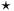 symbol is usually used to represent cross-correlation in
standard math.

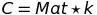

Each element 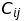 of the cross-correlation is the sum of the
element-wise product of 9 elements in the neighborhood of 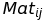
with the 9 elements of . Our goal is to define the 
operation using tensor algebra operations only. First, let's define 
in standard algebra with the equation:

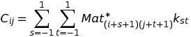

 where 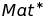 is a "dilated" version of ![Mat][Mat]:
 expanded by 1 element in each 2-D direction (intuitively: up, down, left, & right)
 with 0 values along the edges and in the corners.

In the Tensor Algebra we define all arithmetic combinations of tensor elements using
***reduce***. We define the 2-D "" operation in 5-steps
using Tensor Algebra operations:

1. Use the ***translate*** operation to construct 9 versions of ,
then ***join*** the 9 into a single 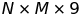 shaped tensor
  * One version each translated with offsets *(-1, -1), (-1, 0), (-1, 1), (0, -1), (0, 0), (0, 1), (1, -1),
    (1, 0), and (1, 1)*
  * Note that the values of the 9 tensors at index *(i, j)* taken together are the values of the original 
    neighborhood of element *(i, j)* in 
2. Duplicate  once for each element of the original  tensor:
  * use the ***pivot*** operation to construct a 1x1x3x3 version of 
  * use the ***broadcast*** operation to duplicate  
   times in the `_X` and `_Y` dimensions, constructing a 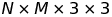 shaped tensor
  * Use the ***reshape*** operation to construct an  shaped tensor
  * Note that the 9 values in the `_Z` dimension of this 
    tensor at each coordinate *(i, j)* in the (`_X`, `_Y`) plane are the original
     kernel elements "stetched out" (i.e., reshaped)
    to 1x1x9 shape.
3. Tensors from steps (1) and (2) are both  tensors.
  In this step we join ("stack") them along the 4*th* dimension into a single
  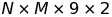 shaped tensor
  * Think of the tensor as an  matrix, at each index is a 9x2 matrix made up of 9 elements from  side-by-side with 9 elements from 
4. Use the ***reduce*** operation on tensor from (3) by multiplicative reduction
  of the 4*th* dimension, constructing a single 
  * This step multiplies each element in the neighborhood of each 
    element with the corresponding kernel element
5. Use the ***reduce*** operation on the  tensor
  from (4) by additive reduction of the 3*rd* dimension to construct an  tensor
  * This sums together the 9 products at each index in (4), which is the cross-correlation
    of the original tensors.

Note: steps (4) and (5) would probably be more efficiently defined as a single
***reduce*** along both 4*th* and 3*rd* dimensions. The Tensor Algebra API defines
*sum* and *product* reduction operations for all compute platforms. So for coding
purposes, using *sum* and *product* is easier.

#### "" Operator in Scala using the Tensor Algebra API

```
/**
 * 2D cross-product of tensor A of magnitude (N x M), and kernel k of
 * magnitude (3 x 3).
 **/

cross2D(Mat: TensorExpr[Tensor], k: TensorExpr[Tensor]): TensorExpr[Tensor] = {
  val Array(N, M) = Mat.magnitude

  // 1. Join 9 translated versions of Mat into a single NxMx9 tensor
  // --
  val translations =
    (for(ii <- 1 to -1 by -1;
         jj <- 1 to -1 by -1) yield {
      translate(tensor, Array(ii, jj))
    })
    .reduce({ case (expr1, expr2) =>
      expr1.flatMap(t1 =>
        expr2.flatMap(t2 => join(_Z, t1, t2))) })

  // 2. pivot kernel into _Z and _W dimensions (so it is 1x1x3x3), then broadcast
  // and reshape kernel to NxMx9 shape
  val repeated_kernel =
    for(k1 <- pivot(k, _X, _Z);
        k2 <- pivot(k1, _Y, _W);
        k3 <- broadcast(k2, _X, N);
        k4 <- broadcast(k3, _Y, M);
        r  <- reshape(k4, Array(N, M, 9))) yield { r }

  // 3. Join the two tensors into NxMx9x2 shape
  // --
  val joined = join(_W, translations, repeated_kernel)

  // 4. & 5. Reduce: first reduce 1 dimension by multiplication, then
  //    1 more dimension by summation
  // Note that reduction always applies to *lowest* dimensions, so we must
  // invert the joined tensor before reducing, and finally invert the result
  // to yield a final NxM tensor.
  // --
  for(j0  <- joined;
      j1  <- invert(j0);
      r0  <- reduce(j1, 1, PRODUCT);
      r1  <- reduce(r0, 1, SUM);
      result <- invert(r1)) yield { result }
}
```

## Example 3: [Conway's Game of Life](https://en.wikipedia.org/wiki/Conway%27s_Game_of_Life) in the Tensor Algebra

We can define a tensor expression computing the X+1*th* generation of the Game of Life from the X*th* (previous) generation. By repeatedly evaluating this expression using the previous output as input we can "run" the Game of Life for as many generations as we care to.

Note that in the Game of Life the value of the *(i, j)-th* element in generation X+1 can be completely determined from the 9 elements comprising the  neighborhood around *(i, j)* in generation X.

In the Tensor Algebra, this means we can define the  tensor expression describing X+1*th* generation as a custom reduction of an  tensor built from the X*th* generation.

Not shown here: how to define custom reduce operations such as the kernel operation of the Game of Life. Because reduce operations may be run on a variety of different hardware, there are different ways to express them. There are plug-in libraries supporting different runtime environments:
* Java VM: reduce operations can be expressed in any JVM language (Java, Scala, Clojure, etc.)
* Aparapi: reduce operations can be expressed in a restricted form of Java defined by the [Aparapi](http://aparapi.com/) project
* OpenCL: reduce operations can be expressed in raw OpenCL/C to target compute hardware most efficiently

Note that an OpenCL implementation of this 1 generation reduction evaluated on a single mid-range GPU will run 20-50x faster than a general JVM implementation. The Aparapi implementation speed will fall somewhere between the general JVM implementation and the OpenCL implementation.

```
// A custom reducing function. Must be defined in a way compatible with the
// target evaluation runtime.
val lifeReduction: ReduceFunction[Int] = ???

// Game Of Life computation for 1 generation
lifeGeneration(tensor: TensorExpr[Tensor]): TensorExpr[Tensor] = {
  // 1. Join 9 translated versions of Mat into a single NxMx9 tensor
  // --
  val translations =
    (for(ii <- 1 to -1 by -1;
         jj <- 1 to -1 by -1) yield {
      translate(tensor, Array(ii, jj))
    })
    .reduce({ case (expr1, expr2) =>
      expr1.flatMap(t1 =>
        expr2.flatMap(t2 => join(_Z, t1, t2))) })

  // 2. Reduce the NxMx9 tensor in the _Z dimension using the
  //    lifeReduction op
  // Since reduction always applies to the lowest dimensions, tensor must
  // be inverted to perform lifeReduction op, and inverted again after
  // --
  for(ts <- translations;
      i  <- invert(ts);
      l0 <- reduce(i, 1, lifeReduction);
      result <- invert(l0)) yield { result }
}
```

## Inspiration

Consider the *convolution* and *cross-correlation* operations. These are common
operations in image and audio processing, neural networks, and several other
real-world computational scenarios. Both operations combine two N-dimensional
arrays (aka tensors) into a new N-dimensional array of the same dimension.
If you are unfamiliar, read [this good explanation of 2-D convolution and
cross-correlation in medical imaging](https://glassboxmedicine.com/2019/07/26/convolution-vs-cross-correlation/) by Rachel Draelos.

Both operations are "embarrassingly parallel". Each element of the result is
completely independent from all others.

Imperative and functional implementations of these operations are fairly obvious.

* An imperative implementation requires nested looping over the indexes of both
  tensors, placing the results in a result tensor. The principal feature
  of this implementation is nested `for` loops.
* A functional implementation abstracts the looping with mapping and folding. The
  principal feature of this implementation is use of nested `map` and `fold` operations
  on the tensor element values.

Either implementation does not yield easily to automated parallelization of the code.
If you have a processor such as a GPU available, which typically has 1000+ cores,
you would want to re-write these implementations with heavy parallelism in mind. This
would involve thread and task management with the associated heavy coding overhead.

However, by using a few basic operations designed for parallelism it would be possible
to implement cross-correlation and convolution in such a way that they could be
automatically parallelized to the maximum extent available to the local computation
platform.

The Tensor Algebra is comprised of a few simple operations that are relatively easy
to evaluate efficiently using highly parallel processing hardware. These operations
can be combined to described complex operations, such as N-dimensional cross-correlation,
Fourier transforms, particle and field simulations, and much more. Thus the performance
boost available from local computation platforms can be realized automatically without
sacrificing Scala's expressiveness.

## Basic Concepts: Dimensionality and Magnitude

### Scalar Values, or Every Tensor has Infinite Dimension

Think of a scalar tensor as a simple box holding a single value. The magnitude of
this "box" is 1 along every side.

In the Tensor Algebra a scalar tensor is considered a tensor with magnitude 1 in
every dimension. It could be thought of as having magnitude 1 in `_X`, and also
having magnitude 1 in `_Y`, in `_Z`, or in any higher dimension.

A *scalar tensor* (or simply a "scalar") then is any tensor with magnitude 1 in
every dimension. It has a single element value.

This implies, by the way, that *every* tensor has magnitude of at least 1 in every
dimension. For example, a 3x3 2-D tensor has depth 3 in the `_X` dimension, 3 in
the `_Y` dimension, 1 in the `_Z` dimension and 1 in every other dimension after
`_Z`.

#### The Order and Naming of Dimensions

Without a common definition of dimensions, a 3x3 tensor could arbitrarily have
magnitude 3 in the `_X` and `_Y` dimensions, or the `_Y` and `_Z` dimensions, or the
`_X` and `_W` dimensions, etc.

In order to be able to compare and combine tensors with each other we assume there
is a common order to dimensions. We assign the nominal symbol "`_X`" to the first
dimension, "`_Y`" to the second dimension, and "`_Z`" to the third. For dimensions
4 and above we start naming them with the letter "`_W`", and work backwards through
the English alphabet: "`_V`", "`_U`", "`_T`", "`_S`", then "`_R`", etc. "`_A`" then
is the 26*th* dimension. After that we use "`_XX`", "`_YY`", etc.

So when we say a tensor is magnitude "3x4", it is understood this means magnitude
3 in the `_X` dimension, and magnitude 4 in the `_Y` dimension.

A tensor described as "3x3 in the `_X` and `_Z` dimensions" would more formally
be said to have magnitude 3x1x3.

#### Magnitude Dictates Dimensionality

When we say a tensor is "2-D", or "3-D", or any "*n*-D" what we are describing is
the last dimension with magnitude greater than 1. So a 1-D tensor of magnitude 3
has magnitude 3 in the `_X` dimension, and magnitude 1 for every dimension after
`_X`.

A 3-D tensor will have a magnitude greater than 1 in the `_Z` direction. It *may*
have magnitude greater than 1 in the `_X` or `_Y` directions (and it may not).
It definitely will have magnitude 1 in the `_W` dimension and every dimension after.

This means scalar tensors are 0-D, since a scalar tensor has magnitude 1 in every
dimension.

## Some Simple Tensor Operations

Definitions of some basic operations using the Tensor Algebra. I intend these to
illustrate the Tensor Algebra is capable of expressing higher level complex operators.

### Constructing Tensors Filled with Constant Values

### Constructing an Identity Tensor

### Slicing a Tensor

## More Rigorous Definitions of The Basic Algebra Operations

### *Translate*

### *Broadcast*

### *Reduce*

### *Reshape*

### *Split*

### *Join*

## Writing Custom Reduce Operations

#### In Any JVM Language: Slowest but Easiest

#### In Aparapi-compatible Java: Faster but Harder

#### In OpenCL Driver Runtime: Fastest but Requires OpenCL Knowledge


[src-NxM]: http://www.sciweavers.org/tex2img.php?eq=N\times%20M&bc=White&fc=Black&im=jpg&fs=12&ff=arev&edit=

[src-3x3]: http://www.sciweavers.org/tex2img.php?eq=3\times%203&bc=White&fc=Black&im=jpg&fs=12&ff=arev&edit=

[src-NxMx9]: http://www.sciweavers.org/tex2img.php?eq=N\times%20M\times9&bc=White&fc=Black&im=jpg&fs=12&ff=arev&edit=

[src-NxMx3x3]: http://www.sciweavers.org/tex2img.php?eq=N\times%20M\times%203\times%203&bc=White&fc=Black&im=jpg&fs=12&ff=arev&edit=

[src-NxMx9x2]: http://www.sciweavers.org/tex2img.php?eq=N\times%20M\times9\times2&bc=White&fc=Black&im=jpg&fs=12&ff=arev&edit=

[src-Mat]: http://www.sciweavers.org/tex2img.php?eq=Mat&bc=White&fc=Black&im=jpg&fs=12&ff=arev&edit=

[src-Matstar]: http://www.sciweavers.org/tex2img.php?eq=Mat^*&bc=White&fc=Black&im=jpg&fs=12&ff=arev&edit=

[src-k]: http://www.sciweavers.org/tex2img.php?eq=k&bc=White&fc=Black&im=jpg&fs=12&ff=arev&edit=

[src-C]: http://www.sciweavers.org/tex2img.php?eq=C&bc=White&fc=Black&im=jpg&fs=12&ff=arev&edit=

[src-Eq1]: http://www.sciweavers.org/tex2img.php?eq=C=Mat%20\star%20k&bc=White&fc=Black&im=jpg&fs=12&ff=arev&edit=

[src-Cij]: http://www.sciweavers.org/tex2img.php?eq=C_%7bij%7d&bc=White&fc=Black&im=jpg&fs=12&ff=arev&edit=

[src-star]: http://www.sciweavers.org/tex2img.php?eq=\star&bc=White&fc=Black&im=jpg&fs=12&ff=arev&edit=

[src-sigma]: http://www.sciweavers.org/tex2img.php?eq=\sum&bc=White&fc=Black&im=jpg&fs=12&ff=arev&edit=

[src-Matij]: http://www.sciweavers.org/tex2img.php?eq=Mat_%7bij%7d&bc=White&fc=Black&im=jpg&fs=12&ff=arev&edit=

[src-Eq2]: http://www.sciweavers.org/tex2img.php?eq=C_%7bij%7d=\sum_%7bs=-1%7d^1\sum_%7bt=-1%7d^1%20Mat^*_%7b%28i%2Bs%2B1%29%28j%2Bt%2B+1%29%7dk_%7bst%7d&bc=White&fc=Black&im=jpg&fs=12&ff=arev&edit=
