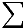

# Tensor Algebra

A Scala language implementation of a tensor algebra. The basic operations of
the algebra are both highly expressive, and highly parallelizable.

Each of the algebra's operations is amenable to highly parallelized implementations.
Therefore it is possible to define different evaluators for efficiently calculating
tensor algebra expressions with parallel processors of
varying scale:
* Hardware computational elements such as GPUs or GPU arrays, multi-core CPUS,
  DSPs, FPGAs, and other specialty computation hardware
* Cloud-based map-reduce systems such as Spark, Google Tensorflow, etc.

The basic operations of the algebra are individually simple to understand. The
algebra is expressive, meaning that even extremely complex N-dimensional computations
can be completely expressed as combinations of these basic operations. For example,
 matrix multiplication, convolution and cross-correlation, Fourier
transforms, etc. can all be expressed with this algebra without looping or recursion.

## Inspiration

Consider the *convolution* and *cross-correlation* operations. These are common
operations in image and audio processing, neural networks, and several other
real-world computational scenarios. Both operations combine two N-dimensional
arrays (aka tensors) into a new N-dimensional array of the same dimension.
If you are unfamiliar, read [this good explanation of 2-D convolution and
cross-correlation in medical imaging](https://glassboxmedicine.com/2019/07/26/convolution-vs-cross-correlation/).

Imperative and functional implementations of these operations are fairly obvious.

* An imperative implementation requires nested looping over the indexes of both
  tensors, placing the results in a result tensor. The principal feature
  of this implementation is nested `for` loops.
* A functional implementation abstracts the looping with mapping and folding. The
  principal feature of this implementation is use of nested `map` and `fold` operations
  on the tensor element values.

The imperative implementation requires the implementor to code the execution
plan for the operations explicitly. In different execution environments, e.g. CPU vs
GPU, will require very different implementations.

The functional implementation abstracts the looping aspects of the implementation,
allowing the data container (the tensor classes/objects) to "decide" the best
way to carry out the calculation at runtime. Heavy use of recursion makes the runtime's
job of devising an efficient execution plan quite difficult -- impractically so
for even moderately complex tensor expressions such as N-dimensional convolution.

The conclusion: in Scala processing of numerical data, especially multi-dimensional numerical data, is easy to express but rather slow. Mechanisms for speeding up either imperative or functional expressions of numerical data are lacking. Tensor algebra promises to fix these issues.   

### Tensor Algebra's Basic Operations

A third option exists for expressing and efficiently evaluating arbitrarily complex numerical operations, such as N-dimensional
convolution and cross-correlation, in Scala and the JVM in general. This tensor algebra utilizes a few simple operations to support expressing complex computations in a way that is relatively easy to evaluate efficiently using highly parallel processing.

Recall that a "tensor" is just the formal name for an N-dimensional rectangular array of any dimension. This includes 0-D (scalar values), 1-D (arrays), 2-D (matrixes), 3-D (rectangular volumes), and higher.

The basic operations of this tensor algebra are:
* ***translate*** -- define a new tensor by "moving" values in an original
  tensor to different indexes using fixed offset in each dimension
* ***permute*** -- This is the general term for rotating a tensor, allowing rotation in multiple dimensions at once
* ***reshape*** -- Without altering the overall number of elements in a tensor, define
  a tensor which takes an original tensor's elements while altering the dimensionality and arity.
  For example changing a 3x4x5 tensor into a 10x6 tensor. Same number of elements,
  different dimensionality and/or arity.
* ***split*** -- divide a tensor into several tensors of reduced
  dimensionality along one or more dimensions
* ***join*** -- additively "stacking" multiple tensors of the same dimensionality
  into a single tensor of higher dimensionality
* ***broadcast*** -- Projecting a lower dimensionality tensor into a higher
  dimensionality one by duplication
* ***reduce*** -- Creating a new tensor with reduced dimensionality from an original
  by combining elements along one or more dimensions using an arbitrary associative arithmetic operation.
  * An arithmetic function that is both commutative & associative yields a much greater opportunity for evaluator parallelism

With this tensor algebra we define very complex operations from linear and high-dimensional algebras including
matrix multiplication, convolution, cross-correlation, Fourier transformation, complex image and sound manipulation functions. By interpreting data graphs as sparse matrices, you can implement many complex
graph algorithms in the tensor algebra as well.

## Tensor Algebra API Exaples

### Example 1: 2-D Cross-Correlation Defined using Tensor Algebra

Let's consider the cross-correlation of an  2-D matrix  with a  2-D matrix  (aka *kernel*). The  symbol is usually used to represent cross-correlation in
standard math.


Each element  of the cross-correlation is the sum of the element-wise product of 9 elements in the neighborhood of  with the 9 elements of . Our goal is to define the  operation using tensor algebra operations only. First, let's define  in standard algebra with the equation:


 where  is a "dilated" version of ![Mat][Mat]: expanded by 1 element in each 2-D direction (intuitively: up, down, left, & right) with 0 values along the edges and in the corners.

 This animation, borrowed from the article linked to above, illustrates the concept (though unfortunately the author uses the inaccurate term *convolve*, which is often confused with the more correct *cross-correlation* in mathematical computing):

 

 The yellow box represents a  kernel, which is being multiplied with the  neighborhood of each individual member of the green matrix. The product of the multiplication is then summed up to produce the output value of each element in the resultant matrix (pink).

#### "" Operator as a 4-D ***reduce*** in the Tensor Algebra

In the tensor algebra you do not use iterative operators such as "". Instead we define all arithmetic combinations of tensors using ***reduce***. We define the 2-D "" operation combining an  shaped tensor with a  shaped kernel tensor as a single ***reduce*** of a *4-D*  shaped tensor back down to 2-D dimensionality.

We can define this in 5-steps using tensor algebra operations:

1. Construct 9 translated versions of , and join them into a single  shaped tensor
  * One version each translated with offsets *(-1, -1), (-1, 0), (-1, 1), (0, -1), (0, 0), (0, 1), (1, -1),
    (1, 0), and (1, 1)*
  * Note that the values of the 9 tensors at index *(i, j)* taken together are the values of the original 
    neighborhood of element *(i, j)* in 
2. Broadcast  into a  shaped tensor, and reshape to  shape
3. Tensors from steps (1) and (2) are both 3-D tensors. In this step we join them along the 4*th* dimension into a single  shaped tensor
4. Reduce the tensor from (3) down to  shape by multiplicative reduction of the 4*th* dimension
  * In effect, this step multiplies each element in the neighborhood of each 
    element with the corresponding kernel element.
5. Reduce the  tensor from (4) down to  shape by additive reduction of the 3*rd* dimension
  * In effect, this sums together the 9 products of the original ![Matij][Matij] element neighborhood and the
    kernel elements

(Note: steps (4) and (5) would more efficiently be defined as a single ***reduce*** along both 4*th* and 3*rd* dimensions. For simplicity, the steps are described explicitly to make relationship to the  more obvious.)

####  Operator in Scala using Tensor Algebra API

The Tensor Algebra API is essentially a set of `TensorExpr` combinator functions. Each of the basic operators ***translate***, ***permute***, ***reshape***, etc. produce a new `TensorExpr` from input `TensorExpr` values.

```
/** 2D cross-product of tensor A of magnitude (N x M), and kernel k of
magnitude (3 x 3). **/

cross2D(A: TensorExpr[Float], k: TensorExpr[Float]): TensorExpr[Float] = {
  val Array(N, M) = A.magnitude

  // 1. Join 9 translated versions of A into a single NxMx9 tensor
  // --
  val translations =
    join((for(ii <- -1 to 1;
             jj <- -1 to 1) yield {
         translate(A, Array(_X, _Y), Array(ii, jj))
         }), _Z)

  // 2. broadcast the kernel to NxMx3x3 tensor, then reshape to NxMx9
  // --     
  val repeated_kernel = reshape(
    broadcast(k, Array(_X, _Y), Array(N, M)),
    Array(N, M, 9))

  // 3. Join the two tensors into NxMx9x2 shape
  // --
  val joined = join(translations, repeated_kernel, _W)

  // 4. & 5. Reduce first by multiplication in _W dimension, then
  //    summation in the _Z dimension: yields NxM cross-correlated tensor
  // --
  reduce(
    reduce(, _W, _PRODUCT),
    _Z, _SUM)
  }
}
```

* Input: `A` is a  tensor expression, and `k` is assumed to be a  tensor expression
  * `A.magnitude` yields `Array(N, M)`, the size of the 2-D tensor `A` in the `_X` and `_Y` dimensions.
* `_X`, `_Y`, `_Z`, `_W` are nominal constants representing the first,
second, and higher dimensions respectively.
* `_SUM` and `_PRODUCT` are reducing functions for summation and product respectively
* `translations` is a tensor expression joining 9 different translated versions of the value of `A` into a single  tensor
  * Note that `translate` backfills with 0 values by default
* `repeated_kernel` is
a tensor expression broadcasting the value of `k` (a  tensor) in the `_X` and `_Y` dimensions and reshaping to  shape
* `joined` joins `translations` and `repeated_kernel` by stacking in the `_W` dimension
* Finally, `cross2D` yields a tensor expression which reduces `joined` by multiplication in the `_W` dimension, and then reduces by summation in the `_Z` dimension
  * The result will be an  tensor expression

The `cross2D` expression constructs the cross-product of any  tensor expression `A` and any  tensor expression `k`.

*Note: Some necessary checking is elided here for simplicity: we should be making sure `A` is indeed 2-D, that `k` is indeed  in size, etc.*

## Example 2: [Conway's Game of Life](https://en.wikipedia.org/wiki/Conway%27s_Game_of_Life) in the Tensor Algebra

We can define an expression computing generation X+1 the Game of Life from generation X. The value of the `(i, j)`*th* element in generation X+1 can be completely determined from the 9 elements comprising the  neighborhood around `(i, j)` in generation X.

In the Tensor Algebra, this means we can define the  tensor describing X+1*th* generation as a custom reduction of an  tensor built from the X*th* generation.

Not shown here: how to define custom reduce operations. Because reduce operations may be run on a variety of different hardware, there are different ways to express them. There are plug-in libraries supporting different runtime environments:
* Java VM: reduce operations can be expressed in any JVM language
* OpenCL: For highly parallel compute hardware evaluation: GPUs, DSPs, FGPAs, etc.

```
// A custom reducing function. Desciption of how to make these
// described elsewhere: must be defined to be compatible with the
// evaluation runtime.
val lifeReduction: ReducingOp = ???

// Game Of Life computation for 1 generation
def lifeGeneration(genX: Tensor[Int]): Tensor[Int] = {
  val Array(N, M) = genX.magnitude

  // 1. Join 9 translated versions of genX into a single NxMx9 tensor
  // --
  val translations =
    join((for(ii <- -1 to 1;
             jj <- -1 to 1) yield {
         translate(A, Array(_X, _Y), Array(ii, jj))
         }), _Z)

  // 2. Reduce the NxMx9 tensor back down to NxM
  reduce(translations, _Z, lifeReduction)
}
```

An OpenCL implementation of the 1 generation reduction evaluated on a single mid-range GPU will run 20-50x faster than a general JVM implementation.

## Basic Concepts: Dimensionality and Magnitude

### Scalar Values, or Every Tensor has Infinite Dimension

Think of a scalar tensor as a simple box holding a single value. The magnitude of this "box" is 1 along every side.

If you think about it, a scalar tensor has magnitude 1 in every dimension. It could be thought of as having magnitude 1 in `_X`, and also having magnitude 1 in `_Y`, in `_Z`, or in any higher dimension.

A *scalar tensor* (or simply a "scalar") then is any tensor with magnitude 1 in every dimension. It has a single element value. Any ***reduce*** operation on a scalar tensor in any dimension(s) will yield the exact same scalar tensor.

A scalar arithmetic value is synonymous with a scalar tensor have the same single element value in this Tensor Algebra. For example, the integer 18 is synonymous with a scalar tensor having element value 18. There is a 1:1 bidirectional mapping between the number line and the set of all numeric scalar tensors.

Note that every tensor has magnitude of at least 1 in every dimension. For example, a 3x3 2-D tensor has depth 3 in the `_X` dimension, 3 in the `_Y` dimension, 1 in the `_Z` dimension and 1 in every other dimension after `_Z`.

#### The Order and Naming of Dimensions

Without a common definition of dimensions, a 3x3 tensor could arbitrarily have magnitude 3 in the `_X` and `_Y` dimensions, the `_Y` and `_Z` dimensions, the `_X` and `_W` dimensions, etc.

In order to be able to compare and combine tensors with each other we assume there is a common order to dimensions. We assign the nominal symbol "`_X`" to the first dimension, "`_Y`" to the second dimension, and "`_Z`" to the third. For dimensions 4 and above we start naming them with the letter "`_W`", and work backwards through the English alphabet: "`_V`", "`_U`", "`_T`", "`_S`", then "`_R`", etc. "`_A`" then is the 26*th* dimension. After that we use "`_XX`", "`_YY`", etc.

So when we say a tensor is magnitude "3x4", it is understood this means magnitude 3 in the `_X` dimension, and magnitude 4 in the `_Y` dimension.

A tensor described as "3x3 in the `_X` and `_Z` dimensions" would more formally be said to have magnitude 3x1x3.

#### Magnitude Dictates Dimensionality

When we say a tensor is "2-D", or "3-D", or any "*n*-D" what we are describing is the last dimension with magnitude greater than 1. So a 1-D tensor of magnitude 3 has magnitude 3 in the `_X` dimension, and magnitude 1 for every dimension after `_X`.

A 3-D tensor will have a magnitude greater than 1 in the `_Z` direction. It *may* have magnitude greater than 1 in the `_X` or `_Y` directions (and it may not). It definitely will have magnitude 1 in the `_W` dimension and every dimension after.

This means scalar tensors are 0-D, since a scalar tensor has magnitude 1 in every dimension.

## Some Simple Tensor Operations

Definitions of some basic operations in the Tensor Algebra.

### Constructing Tensors Filled with Constant Values

### Constructing an Identity Tensor

### Slicing a Tensor

## More Rigorous Definitions of The Basic Algebra Operations

### *Translate*

### *Permute*

### *Broadcast*

### *Reduce*

### *Reshape*

### *Split*

### *Join*

## Writing Custom Reduce Operations

#### In Any JVM Language: Slowest but Easiest

#### In Aparapi-compatible Java: Faster but Harder

#### In OpenCL Driver Runtime: Fastest but Requires OpenCL Knowledge


[src-NxM]: http://www.sciweavers.org/tex2img.php?eq=N\times%20M&bc=White&fc=Black&im=jpg&fs=12&ff=arev&edit=

[src-3x3]: http://www.sciweavers.org/tex2img.php?eq=3\times%203&bc=White&fc=Black&im=jpg&fs=12&ff=arev&edit=

[src-NxMx9]: http://www.sciweavers.org/tex2img.php?eq=N\times%20M\times9&bc=White&fc=Black&im=jpg&fs=12&ff=arev&edit=

[src-NxMx3x3]: http://www.sciweavers.org/tex2img.php?eq=N\times%20M\times%203\times%203&bc=White&fc=Black&im=jpg&fs=12&ff=arev&edit=

[src-NxMx9x2]: http://www.sciweavers.org/tex2img.php?eq=N\times%20M\times9\times2&bc=White&fc=Black&im=jpg&fs=12&ff=arev&edit=

[src-Mat]: http://www.sciweavers.org/tex2img.php?eq=Mat&bc=White&fc=Black&im=jpg&fs=12&ff=arev&edit=

[src-Matstar]: http://www.sciweavers.org/tex2img.php?eq=Mat^*&bc=White&fc=Black&im=jpg&fs=12&ff=arev&edit=

[src-k]: http://www.sciweavers.org/tex2img.php?eq=k&bc=White&fc=Black&im=jpg&fs=12&ff=arev&edit=

[src-C]: http://www.sciweavers.org/tex2img.php?eq=C&bc=White&fc=Black&im=jpg&fs=12&ff=arev&edit=

[src-Eq1]: http://www.sciweavers.org/tex2img.php?eq=C=Mat%20\star%20k&bc=White&fc=Black&im=jpg&fs=12&ff=arev&edit=

[src-Cij]: http://www.sciweavers.org/tex2img.php?eq=C_%7bij%7d&bc=White&fc=Black&im=jpg&fs=12&ff=arev&edit=

[src-star]: http://www.sciweavers.org/tex2img.php?eq=\star&bc=White&fc=Black&im=jpg&fs=12&ff=arev&edit=

[src-sigma]: http://www.sciweavers.org/tex2img.php?eq=\sum&bc=White&fc=Black&im=jpg&fs=12&ff=arev&edit=

[src-Matij]: http://www.sciweavers.org/tex2img.php?eq=Mat_%7bij%7d&bc=White&fc=Black&im=jpg&fs=12&ff=arev&edit=

[src-Eq2]: http://www.sciweavers.org/tex2img.php?eq=C_%7bij%7d=\sum_%7bs=-1%7d^1\sum_%7bt=-1%7d^1%20Mat^*_%7b%28i%2Bs%2B1%29%28j%2Bt%2B+1%29%7dk_%7bst%7d&bc=White&fc=Black&im=jpg&fs=12&ff=arev&edit=
